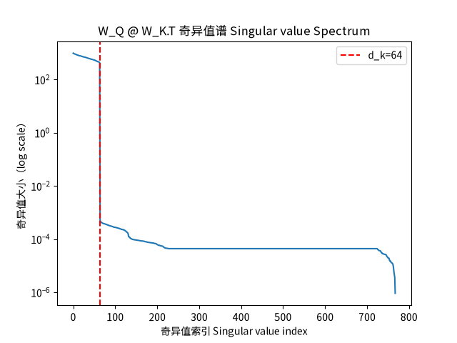

## qkv_svd

### Project Overview 项目简介：
from the singular value decomposition (SVD) perspective to analysis attention layer

对单头attention机制做svd奇异值分解，验证d_k维度作为秩上界对attention机制表达能力的硬约束

### Theoretical Basis 理论基础：
- the shape of W_Q or W_K is (embedding_dim, d_k)，so the rank(W_Q), rank(W_K) ≤ d_k
- for any metrices A、B：rank(AB) ≤ min(rank(A), rank(B))，Substituting into the formula rank(W_Q @ W_K.T) ≤ rank(W_Q) ≤ d_k

### Experimental Design 实验设计：
- Model: single head attention, no position encoding, no FFN layer / 模型：单头 Attention，无位置编码，无 FFN
- Task: replication task(input indexes is y label) / 任务：复制任务（输入序列即标签）
- Control Variable: keep up the other hyperparameters, change the d_k_list[16,32,64,128] / 控制变量：固定其他超参数，改变 d_k ∈ {16, 32, 64, 128} 
- Analysis Objection: the singular value spectrum of W_Q @ W_K.T after training / 分析对象：训练后的 W_Q @ W_K.T 的奇异值谱

### Experimental Conclusions 实验结论：
Althought the dimention of d_k was eliminated by formulation MN*NK=MK, but it was sediment as rank in result, and it was exposure because svd analysis method. no matter how bigger of mutil-metrices, how much epochs to train, how much gradients to update, it cant exceed that it as bound up of rank, and what become the hard contrain of attention model, I mean its restric into the d_k subspace dim.

d_k的维度虽然通过MN*NK=MK的方式消掉了，但是它始终作为秩隐含在结果当中，通过svd，它作为奇异值又重新显式暴露了出来。即使模型的矩阵乘法规模再大，无论训练多少轮，梯度如何更新，它作为秩上界是无法突破的，它的维度成为qkv模型表达能力的硬约束，也就是限制在d_k的子空间维度内。
<<<<<<< HEAD

### Experimental Environment 实验环境：
- Python 3.13
- PyTorch 2.12.0
- matplotlib 3.11.0

### Experimental Environment 实验环境：
- Python 3.13
- PyTorch 2.12.0
- matplotlib 3.11.0